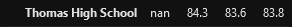

# School District Analysis

## Overview Explain the purpose of this analysis.
We were contracted to perform an analysis of the school district based on testing scores given to us through a database. After finishing the district's analysis for our employer, academic dishonesty is discovered in the school district. In order to uphold the state testing standards, we are asked to replace 9th grade scores for Thomas High School with NaN values and repeat the analysis.

## Results

- District Summary:

All other data holding constant, the only school who was aafected was Thomas High School. Their position in the the top schools was unchanged, their averages droping only slightly. This wasn't enough to drop them in the overall standing amongst the other schools in the district.

- School Summary:

Overall, the averages have dropped in Thomas High School but not by a significant amount. Average reading scores are the only category that improved but once again, it was not by a signicant margin. This, however, did not translate to a increase in passing reading scores. 

- Thomas High's performance after the removal of the 9th Grade
The schools averages were not skewed greatly by the removal of the 9th grade, rather they were around the school average as well. This being the case, the postion of Thomas High among the other schools has not changed even after the remove of the 9th grade.

- The remaining summaries:

The other summaries did not see any significant change as they aren't directly affected by the change in grades at Thomas High School. The biggesdt change is seen in the summary by grades where Thomas High is missing it's value for the ninth grade. The other charts weren't heavily affected by the removal of the scores as they are along Thomas High's average so the values remained around the same.

## Summary: 

After looking over the data changes and the new charts created, the effects of the removal of scores were not very great. The postion of Thomas High remained the same and the averages that were changed only moved by tenths of a percent. This makes me think that the academic dishonesty was on a smaller scale than they were made to think as the scores that were removed only caused Thomas High's numbers to drop slightly. Another thing I noticed was that increase of reading score average did not increasing the passing percentage in reading. This might mean that there are more students on the higher end that are moving the average up but there are still students under the passing score that are driving down the average. The reading courses of Thomas High should focus on more programs to help those that are behind or not understanding the content.
